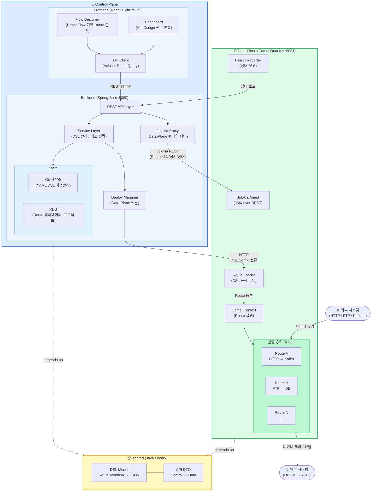

# camel-platform
Apache Camel 기반의 Integration Platform.
Control-Plane(설계/관리)과 Data-Plane(실행 엔진)으로 구성된 모노레포.


## 프로젝트 개요
| 구분 | 역할 | 스택 |
|---|---|---|
| control-plane/frontend | Route 설계 UI(React Flow), 관리 대시보드(Ant Design) | React 18, Vite, TypeScript |
| control-plane/backend | API Server, DSL 저장/배포 관리, Jolokia 프록시 | Spring Boot 3.x, JPA |
| data-plane | Camel Route 실행 엔진 | Camel Quarkus 3.x |
| shared | 공통 DSL 모델, DTO | Java 17 (순수 Java, 프레임워크 의존성 없음) |

## Architecture


## Control-Plane (관리 및 제어 영역)

### Frontend — 핵심 UI 라이브러리

| 라이브러리 | 용도 | 비고 |
|---|---|---|
| **@xyflow/react (React Flow)** | Route 플로우 디자이너 | 노드/엣지 기반 시각 편집기 |
| **Ant Design (antd)** | 관리 콘솔 UI 컴포넌트 | Table, Form, Layout, Menu 등 |
| **React Query (@tanstack/react-query)** | 서버 상태 관리 | API 캐싱, 폴링, 뮤테이션 |
| **Axios** | HTTP 클라이언트 | API 통신 |
| **Zustand** | 클라이언트 상태 관리 | 플로우 에디터 상태, 글로벌 상태 |
| **Monaco Editor** | YAML/코드 편집기 | DSL 직접 편집 시 사용 |

#### Flow Designer 구조 (React Flow 기반)
```
frontend/src/components/designer/
├── FlowDesigner.tsx          ← React Flow 메인 캔버스
├── nodes/                    ← 커스텀 노드 타입
│   ├── SourceNode.tsx        ← From (HTTP, FTP, Kafka 등)
│   ├── ProcessorNode.tsx     ← EIP 프로세서 (Transform, Filter 등)
│   ├── SinkNode.tsx          ← To (DB, MQ, API 등)
│   └── KameletNode.tsx       ← 커스텀 Kamelet 어댑터
├── edges/
│   └── AnimatedEdge.tsx      ← 데이터 흐름 시각화 엣지
├── panels/
│   ├── ComponentCatalog.tsx  ← Camel Component 카탈로그 (드래그 소스)
│   ├── PropertyPanel.tsx     ← 선택된 노드의 설정 폼
│   └── YamlPreview.tsx       ← 실시간 YAML 미리보기 (Monaco)
├── hooks/
│   ├── useFlowToYaml.ts      ← React Flow 모델 → Camel YAML 변환
│   └── useYamlToFlow.ts      ← Camel YAML → React Flow 모델 변환
└── types/
    └── flow.types.ts         ← 노드/엣지 타입 정의
```

- 커스텀 노드는 React Flow의 `nodeTypes`에 등록하여 사용
- Camel Component 카탈로그는 백엔드 API에서 JSON으로 제공 (`GET /api/catalog/components`)
- 플로우 편집 결과는 `useFlowToYaml` 훅으로 Camel YAML DSL로 변환하여 저장
- Kaoto 오픈소스의 Camel 카탈로그 파싱 로직을 참고할 것 (Apache 2.0 라이선스)

#### 관리 콘솔 페이지 구조 (Ant Design 기반)
```
frontend/src/pages/
├── projects/                 ← 프로젝트 CRUD
│   ├── ProjectList.tsx       ← Ant Table + 검색/필터
│   └── ProjectDetail.tsx     ← 프로젝트 상세 + Route 목록
├── routes/                   ← Route 관리
│   ├── RouteList.tsx         ← Route 목록 + 상태(running/stopped)
│   └── RouteDesign.tsx       ← FlowDesigner 임베드 페이지
├── deployments/              ← 배포 관리
│   ├── DeployList.tsx        ← 배포 이력
│   └── DeployDetail.tsx      ← 배포 상태 + 롤백
├── kamelets/                 ← Kamelet 카탈로그
│   └── KameletCatalog.tsx    ← 커스텀 어댑터 목록 + 등록
└── settings/                 ← 플랫폼 설정
    └── DataPlaneConfig.tsx   ← Data-Plane 인스턴스 관리
```

### Backend — API 설계 컨벤션

```
backend/src/main/java/com/example/cp/
├── api/                      ← REST Controller (@RestController)
│   ├── ProjectController.java
│   ├── RouteController.java
│   ├── DeployController.java
│   ├── CatalogController.java    ← Camel Component/Kamelet 카탈로그
│   └── RuntimeController.java    ← Jolokia 프록시 (Route 시작/정지/상태)
├── service/
│   ├── RouteService.java
│   ├── DeployService.java
│   ├── CatalogService.java       ← Camel 카탈로그 JSON 파싱/제공
│   └── RuntimeService.java       ← Jolokia 클라이언트로 Data-Plane 제어
├── store/
│   ├── entity/                   ← JPA Entity
│   ├── repository/               ← Spring Data JPA Repository
│   └── git/                      ← Git 저장소 연동 (JGit)
├── deploy/
│   └── DataPlaneClient.java      ← Data-Plane HTTP 통신
├── config/
│   ├── WebConfig.java            ← CORS, 인터셉터
│   └── JolokiaConfig.java        ← Jolokia 프록시 설정
└── exception/
    ├── GlobalExceptionHandler.java
    └── BusinessException.java
```

#### REST API 규칙
- URL: `kebab-case` 사용 (예: `/api/data-planes`, `/api/route-definitions`)
- 응답: 공통 래퍼 사용 → `ApiResponse<T>` (shared 모듈의 DTO)
- 페이징: Spring Data의 `Pageable` 사용, 프론트에서 `?page=0&size=20`
- 에러: `GlobalExceptionHandler`에서 일관된 에러 응답 반환
- Jolokia 프록시: `/api/runtime/routes/{routeId}/start|stop|status` → 내부적으로 Jolokia REST 호출


## Data-Plane (실행 및 통신 영역)

### Runtime 구성
```
data-plane/src/main/java/com/example/dp/
├── runtime/
│   ├── CamelContextManager.java    ← CamelContext 라이프사이클 관리
│   └── RouteManager.java           ← Route 동적 추가/제거/갱신
├── loader/
│   ├── YamlRouteLoader.java        ← YAML DSL → Route 변환/등록
│   └── RemoteConfigWatcher.java    ← Control-Plane으로부터 설정 수신
├── health/
│   ├── HealthReporter.java         ← 주기적 상태 보고 (→ Control-Plane)
│   └── RouteHealthCheck.java       ← 개별 Route 헬스체크
├── api/
│   └── LoaderController.java       ← DSL 수신 REST 엔드포인트
└── config/
    └── JolokiaConfig.java          ← Jolokia Agent 활성화
```

### Jolokia Agent 설정 (Data-Plane)
```properties
# Jolokia Agent 활성화 - Control-Plane에서 원격 Route 제어 가능
quarkus.camel.management.enabled=true
```
- Jolokia를 통해 노출되는 MBean: `org.apache.camel:type=routes,*`
- 주요 operation: `start()`, `stop()`, `getState()`, `dumpRouteStatsAsXml()`


## 디렉토리 구조
```
camel-platform/
├── control-plane/
│   ├── frontend/                   ← React + React Flow + Ant Design
│   │   ├── src/
│   │   │   ├── components/
│   │   │   │   ├── designer/       ← React Flow 기반 플로우 디자이너
│   │   │   │   └── common/         ← 공통 컴포넌트 (Ant Design 래퍼)
│   │   │   ├── pages/              ← 페이지 컴포넌트
│   │   │   ├── api/                ← API 클라이언트 (Axios 인스턴스)
│   │   │   ├── hooks/              ← 커스텀 훅
│   │   │   ├── stores/             ← Zustand 스토어
│   │   │   ├── types/              ← TypeScript 타입 정의
│   │   │   └── utils/              ← YAML 변환 등 유틸리티
│   │   ├── package.json
│   │   └── vite.config.ts
│   └── backend/                    ← Spring Boot API Server
│       ├── src/main/java/com/example/cp/
│       │   ├── api/                ← REST Controller
│       │   ├── service/            ← 비즈니스 로직
│       │   ├── store/              ← JPA Entity/Repository + Git 연동
│       │   ├── deploy/             ← Data-Plane 통신 클라이언트
│       │   ├── config/             ← Web, Security, Jolokia 설정
│       │   └── exception/          ← 글로벌 예외 처리
│       └── pom.xml
├── data-plane/                     ← Camel Quarkus 런타임
│   ├── src/main/java/com/example/dp/
│   │   ├── runtime/                ← CamelContext, Route 관리
│   │   ├── loader/                 ← DSL 동적 로딩
│   │   ├── health/                 ← 상태 보고
│   │   ├── api/                    ← DSL 수신 엔드포인트
│   │   └── config/                 ← Jolokia 설정
│   └── pom.xml
├── shared/                         ← 공유 모듈 (순수 Java)
│   ├── src/main/java/com/example/shared/
│   │   ├── dsl/                    ← RouteDefinition, NodeDefinition 등
│   │   └── api/                    ← ApiResponse<T>, DTO 클래스
│   └── pom.xml
├── docker/                         ← Docker / Docker Compose
│   └── docker-compose.yml          ← 전체 스택 (BE, DP)
├── pom.xml                         ← Maven parent POM
└── CLAUDE.md
```


## 빌드 방법

### 전체 빌드 순서 (반드시 이 순서 준수)
```bash
# 1. 공유 모듈 먼저
cd shared && mvn clean install

# 2. Control-Plane 백엔드
cd control-plane/backend && mvn clean install

# 3. Data-Plane
cd data-plane && mvn clean package

# 4. Frontend
cd control-plane/frontend && npm install && npm run build
```

### 개발 서버 실행
```bash
# Backend (포트 8080)
cd control-plane/backend && mvn spring-boot:run

# Data-Plane (포트 8081)
cd data-plane && mvn quarkus:dev

# Frontend (포트 5173)
cd control-plane/frontend && npm run dev
```

### Docker Compose (전체 스택)
```bash
cd docker && docker-compose up -d
```


## 핵심 개발 규칙

### 공통
1. **DSL 모델 변경 시** → `shared/dsl` 먼저 수정 후 양쪽 플레인에 반영
2. **Control↔Data 통신 DTO 변경 시** → `shared/api` 수정 후 양쪽 반영
3. **Spring Boot와 Quarkus의 parent pom은 절대 합치지 말 것** (BOM 충돌)
4. **shared 모듈**은 Spring, Quarkus 의존성 없이 순수 Java만 사용

### Frontend
5. **API 호출** → `control-plane/frontend/src/api/` 하위에만 작성
6. **React Flow 커스텀 노드** → `components/designer/nodes/` 하위에 노드 타입별 파일 분리
7. **상태 관리** → 서버 상태는 React Query, 클라이언트 상태는 Zustand
8. **컴포넌트 스타일** → Ant Design 기본 테마 사용, 커스텀은 CSS Module 또는 styled-components
9. **타입 정의** → API 응답 타입은 `types/api.types.ts`, 플로우 관련은 `types/flow.types.ts`에 집중

### Backend
10. **Controller** → 파라미터 검증만 수행, 비즈니스 로직은 Service에 위임
11. **Jolokia 호출** → `RuntimeService`를 통해서만 수행, Controller에서 직접 호출 금지
12. **Git 연동** → JGit 사용, `store/git/` 패키지에 격리

### Data-Plane
13. **Quarkus Native Image** 빌드 가능성을 고려해 reflection 사용 최소화
14. **Route 동적 로딩** → `RouteManager`를 통해서만 CamelContext에 Route 추가/제거
15. **Jolokia Agent** → Control-Plane의 RuntimeService만 접근 가능하도록 네트워크 제한


## 모듈 간 의존 관계
```
Frontend (React)
  → (Axios HTTP) → Control-Plane Backend (Spring Boot :8080)
                       → (HTTP) → Data-Plane Loader (Quarkus :8081)  [DSL 배포]
                       → (Jolokia REST) → Data-Plane Jolokia         [런타임 제어]

shared ← Control-Plane Backend (의존)
shared ← Data-Plane (의존)
```


## 주요 기술 스택 버전

### Backend / Runtime
- Java: 17
- Spring Boot: 3.x
- Quarkus: 3.x
- Camel: 4.x
- Jolokia: 2.x
- JGit: 6.x

### Frontend
- React: 18
- TypeScript: 5.x
- Vite: 5.x
- @xyflow/react (React Flow): 12.x
- Ant Design: 5.x
- @tanstack/react-query: 5.x
- Zustand: 4.x
- Monaco Editor (@monaco-editor/react): 4.x
- Axios: 1.x
- Node: 20+


## 작업 시 주의사항

- `shared` 모듈 변경 후 반드시 `mvn install` 실행해야 다른 모듈에서 참조 가능
- Data-Plane은 Quarkus Native Image 빌드 가능성을 고려해 reflection 사용 최소화
- Frontend 빌드 결과물(`dist/`)은 `.gitignore`에 포함
- React Flow의 `useNodesState`, `useEdgesState` 훅을 사용하여 노드/엣지 상태 관리
- Camel YAML DSL ↔ React Flow 노드 모델 변환 로직은 `hooks/useFlowToYaml.ts`, `hooks/useYamlToFlow.ts`에 집중
- Kaoto 오픈소스(https://github.com/KaotoIO/kaoto)의 Camel 카탈로그 파싱 로직 참고 가능 (Apache 2.0)