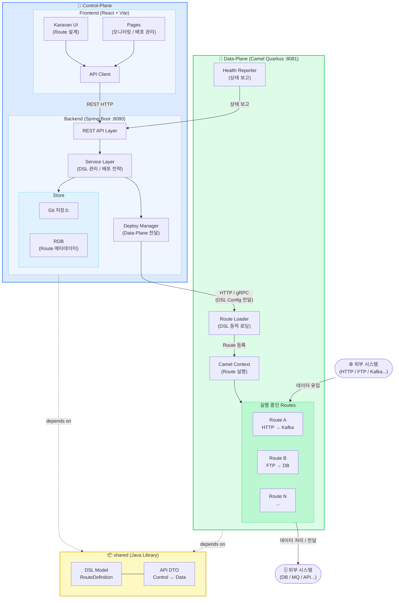
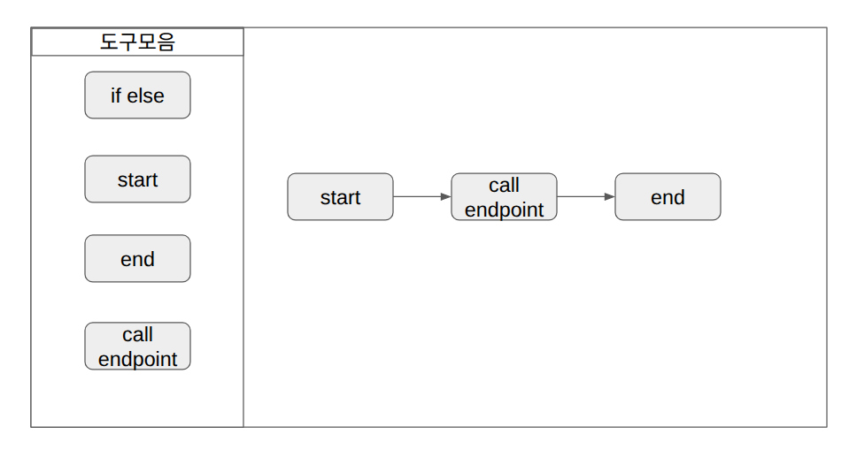

# camel-platform
Apache Camel 기반의 Integration Platform.
Control-Plane(설계/관리)과 Data-Plane(실행 엔진)으로 구성된 모노레포.


## 프로젝트 개요
| 구분 | 역할 | 스택 |
|---|---|---|
| control-plane/frontend | Route 설계 UI, Karavan 임베딩 | React, Vite, TypeScript |
| control-plane/backend | API Server, DSL 저장/배포 관리 | Spring Boot, JPA |
| data-plane | Camel Route 실행 엔진 | Camel Quarkus |
| shared | 공통 DSL 모델, DTO | Java 17 |

## architecture


### Control-Plane (관리 및 제어 영역)
- 가장 많은 백엔드/프론트엔드 개발이 필요한 영역입니다.

- [Frontend] iPaaS 통합 대시보드 개발
  - 프로젝트/워크플로우 목록 관리 UI.
  - Karavan Designer 임베딩: 오픈소스 Karavan 컴포넌트를 React 화면에 내장.

- [Backend] 설계 데이터 관리 API (REST)
  - CRUD API: Karavan에서 생성된 YAML DSL을 Git에 저장하고 불러오는 로직.
  - Kamelet(어댑터) 관리: 커스텀하게 만든 Kamelet 파일들을 카탈로그화하여 프론트엔드에 전달하는 API.
  - 배포 컨트롤러: 사용자가 "배포" 버튼을 눌렀을 때, 특정 Data-Plane(엔진)으로 YAML 파일을 전달하는 로직.

    
### Data-Plane (실행 및 통신 영역) 
- Camel Quarkus를 기반으로 하되, 플랫폼 전용으로 커스터마이징된 **"표준 런타임"**을 만드는 것이 목표입니다.

- [Engine] Runtime 개발
  - 공통 설정: 모든 통합 로직이 공통으로 사용할 application.properties, 에러 처리 정책(Exception Handler), 보안 설정(SSL/TLS).
  - 동적 로더(Dynamic Loader): 외부(API 서버)에서 주는 YAML 파일을 실시간으로 감시하고 로드하는 설정 코드.

- [Adapter] 커스텀 Kamelet(어댑터) 라이브러리 구축
  - 사내 표준 커넥터: 회사가 자주 쓰는 DB 연결 설정이나 특정 API 호출 로직을 Kamelet(YAML)으로 패키징.
  - 데이터 변환 스니펫: 특정 비즈니스 로직(예: 한국식 주소 변환, 복잡한 세금 계산)을 수행하는 재사용 가능한 라우트 조각 개발.

## 디렉토리 구조
```
camel-platform/
├── control-plane/
│   ├── frontend/               ← React + Karavan UI
│   │   ├── src/
│   │   │   ├── components/karavan/
│   │   │   ├── pages/
│   │   │   └── api/            ← API 클라이언트
│   │   ├── package.json
│   │   └── vite.config.ts
│   └── backend/                ← Spring Boot API Server
│       ├── src/main/java/com/example/cp/
│       │   ├── api/            ← REST API
│       │   ├── service/        ← DSL 관리, 배포 전략
│       │   ├── store/          ← Git or RDB 저장
│       │   └── deploy/         ← Data-Plane으로 config 전달
│       └── pom.xml
├── data-plane/                 ← Camel Quarkus 런타임
│   ├── src/main/java/com/example/dp/
│   │   ├── runtime/            ← Camel Context 관리
│   │   ├── loader/             ← DSL 동적 로딩
│   │   └── health/             ← 상태 보고
│   └── pom.xml
├── shared/                     ← 공유 모듈
│   ├── src/main/java/com/example/shared/
│   │   ├── dsl/                ← RouteDefinition 등 DSL 모델
│   │   └── api/                ← Control↔Data 통신 DTO
│   └── pom.xml
├── pom.xml                     ← Maven parent POM
└── CLAUDE.md
```


## 빌드 방법

### 전체 빌드 순서 (반드시 이 순서 준수)
```bash
# 1. 공유 모듈 먼저
cd shared && mvn clean install

# 2. Control-Plane 백엔드
cd control-plane/backend && mvn clean install

# 3. Data-Plane
cd data-plane && mvn clean package

# 4. Frontend
cd control-plane/frontend && npm install && npm run build
```

### 개발 서버 실행
```bash
# Backend (포트 8080)
cd control-plane/backend && mvn spring-boot:run

# Data-Plane (포트 8081)
cd data-plane && mvn quarkus:dev

# Frontend (포트 5173)
cd control-plane/frontend && npm run dev
```

## 핵심 개발 규칙

1. **DSL 모델 변경 시** → `shared/dsl` 먼저 수정 후 양쪽 플레인에 반영
2. **Control↔Data 통신 DTO 변경 시** → `shared/api` 수정 후 양쪽 반영
3. **Spring Boot와 Quarkus의 parent pom은 절대 합치지 말 것** (BOM 충돌)
4. **Frontend API 호출** → `control-plane/frontend/src/api/` 하위에만 작성
5. **shared 모듈**은 Spring, Quarkus 의존성 없이 순수 Java만 사용

## 모듈 간 의존 관계
```
frontend → (HTTP) → control-plane/backend
                         ↓ (HTTP or gRPC)
                      data-plane
                         
shared ← control-plane/backend
shared ← data-plane
```

## 주요 기술 스택 버전

- Java: 17
- Spring Boot: 3.x
- Quarkus: 3.x
- Camel: 4.x
- React: 18
- Node: 20+

## 작업 시 주의사항

- `shared` 모듈 변경 후 반드시 `mvn install` 실행해야 다른 모듈에서 참조 가능
- Data-Plane은 Quarkus Native Image 빌드 가능성을 고려해 reflection 사용 최소화
- Frontend 빌드 결과물(`dist/`)은 `.gitignore`에 포함


## 화면 layout
